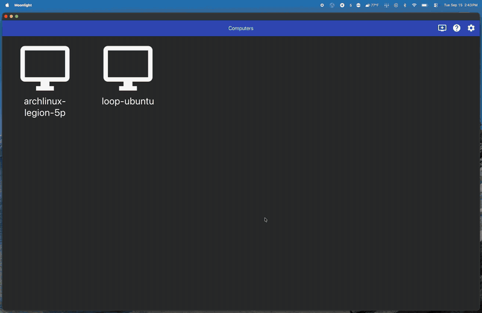

# loop-s1

UMD Loop Challenge Week, software challenge S1. A box-shaped vehicle in
Gazebo Harmonic visits a sequence of random XY waypoints through an arena
of walls, pillars, ramps and hills, with no teleop. ROS 2 Jazzy, Ubuntu 24.04.

[](media/s1-demo.mp4)

The GIF is a full run at about 5.6x speed. Click it for [the real-time
recording](media/s1-demo.mp4). Discs are waypoints (red pending, yellow
current, green reached) and the blue line is the current plan.

## Run it

```bash
mkdir -p ~/loop_ws/src && cd ~/loop_ws/src
git clone https://github.com/benmross/loop-s1.git
cd ~/loop_ws
colcon build --packages-select loop_s1_sim loop_s1_nav
source install/setup.bash
ros2 launch loop_s1_nav s1.launch.py            # Gazebo GUI, random waypoints
ros2 launch loop_s1_nav s1.launch.py rviz:=true # also RViz: costmap, plan, lidar
ros2 launch loop_s1_nav s1.launch.py seed:=7 waypoints:=8
ros2 launch loop_s1_nav s1.launch.py gui:=false # headless
```

The seed is printed at startup, so any run can be repeated exactly. Progress
is logged per waypoint and summarised at the end, and `/mission_status`
carries the same as JSON:

```bash
ros2 topic echo /mission_status --once
```

Tests for the course and the planner run without ROS or Gazebo:

```bash
python3 -m pytest loop_s1_nav/test
```

## How it is put together

```
loop_s1_sim/                      the world
  config/course.yaml              arena, vehicle, every obstacle: the one source of truth
  loop_s1_sim/course.py           parses it; generates the SDF; rasterises footprints
  config/bridge.yaml              gz <-> ROS topics
  launch/sim.launch.py            generates the world, starts Gazebo and the bridge
loop_s1_nav/                      the autonomy
  loop_s1_nav/waypoint_manager.py random waypoints, sequencing, scoring
  loop_s1_nav/navigator.py        planning, following, obstacle stop, recovery
  loop_s1_nav/grid.py             costmap and A*
  launch/s1.launch.py             everything
```

### The course

Obstacles are described once, in `course.yaml`, as walls, boxes, ramps and
hills. The launch file generates the Gazebo world from that file, and both
nodes rasterise the same shapes into their costmap, so the thing the
simulator collides with and the thing the planner avoids cannot disagree.
Ramps are pitched slabs and hills are mostly buried spheres. The vehicle
plans in 2D, so both are keep-out areas rather than terrain.

### The vehicle

A 0.6 x 0.4 x 0.3 m box. `VelocityControl` turns `/cmd_vel` into motion,
`OdometryPublisher` reports its pose, and a 360-sample `gpu_lidar` on top
scans at 10 Hz out to 8 m.

### Waypoints

`waypoint_manager` draws them from free space that is connected to the start,
at least `clearance` beyond the planner's inflation from any obstacle, and
`min_spacing` apart. So every waypoint is reachable, and none is trivially
close to the last. It publishes one goal at a time on `/goal_pose` and moves
on when the vehicle is within `goal_tolerance`.

It also checks the vehicle's actual outline against every obstacle on each
odometry message, and reports contacts and the closest approach.

### Navigation

`navigator` subscribes to `/odom`, `/scan` and `/goal_pose` and publishes
`/cmd_vel`.

1. **Map.** A 0.1 m grid. The `known` layer comes from the course file. The
   `sensed` layer is lidar returns that the course file does not explain:
   a cell needs three returns before it counts, returns within 0.35 m of a
   known obstacle are ignored, and scans taken while turning quickly are not
   mapped because the pose lags them.
2. **Plan.** 8-connected A* that will not cut corners. Cells within
   `inflation` (0.6 m, the vehicle's corner radius plus margin) of an
   obstacle are blocked, and cells within `preferred_clearance` cost more,
   so plans keep to the middle of corridors when there is room. It replans
   when the goal changes, when the lidar marks something on the current plan,
   and when the vehicle drifts more than 1 m off it.
3. **Follow.** Pure pursuit with a 0.8 m lookahead. If the plan is more than
   about 50 degrees off the heading it turns in place first. Speed drops
   near obstacles and near the waypoint, and acceleration is limited.
4. **Safety.** Whatever the map says, forward motion stops if the lidar sees
   anything within 0.45 m ahead. The navigator replans at once; if it is
   still blocked after 3 s it backs up (or turns, if something is behind it)
   and plans again.

A naive "steer at the goal, turn when blocked" controller fails on this
course by design: `pocket_*` is a dead end facing the south, and the two long
walls force a switchback.

### What you see

In Gazebo, waypoints are discs on the ground: red is pending, yellow is
current, green is reached. The current plan is a blue line. In RViz
(`rviz:=true`) there is also the costmap, the lidar and numbered waypoints.

## Topics

| Topic | Type | From |
|---|---|---|
| `/cmd_vel` | geometry_msgs/Twist | navigator |
| `/odom` | nav_msgs/Odometry | Gazebo |
| `/scan` | sensor_msgs/LaserScan | Gazebo |
| `/goal_pose` | geometry_msgs/PoseStamped | waypoint_manager |
| `/waypoints` | geometry_msgs/PoseArray | waypoint_manager |
| `/mission_status` | std_msgs/String (JSON) | waypoint_manager |
| `/plan` | nav_msgs/Path | navigator |
| `/map` | nav_msgs/OccupancyGrid | navigator |

Every tunable is in `loop_s1_nav/config/nav.yaml`.

## If something is left running

A Gazebo server can outlive its launch if only the launch process is
signalled rather than the whole terminal. Before relaunching:

```bash
pkill -f "gz sim"
```
